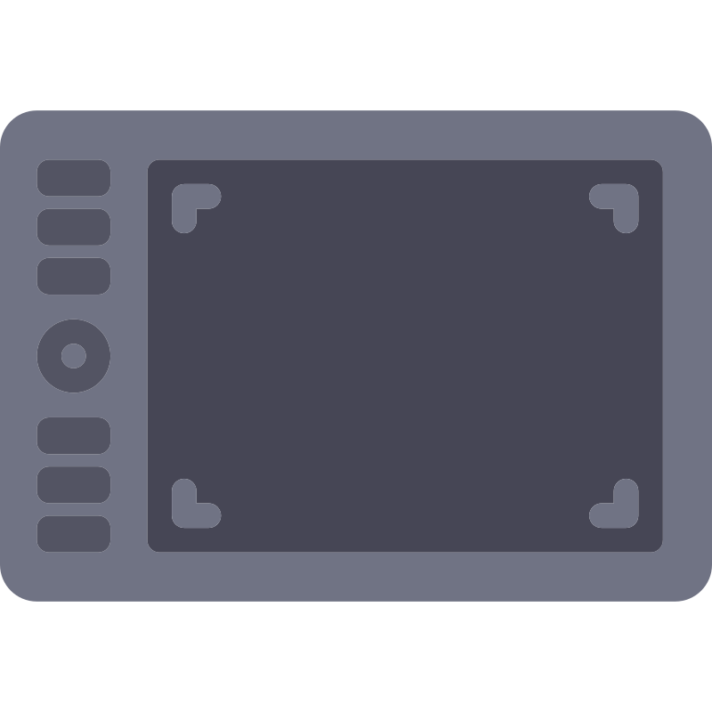

# TabMap

A simple, modern GUI application for configuring graphics tablets on Linux, built with Wails, Go, and Vue.js with light theme.

## Features

- **Device Detection**: Automatically detects connected input devices using `xsetwacom --list devices`
- **Button Remapping**: Assign key combinations (e.g. `ctrl+z`) to any pad/stylus button
- **Touch Ring & Wheel Support**: Map each rotation direction of touch rings, scroll wheels, and touch strips (`AbsWheelUp/Down`, `AbsWheel2Up/Down`, `RelWheelUp/Down`, `StripLeft/Right`) to actions like zoom or brush size
- **Interactive Tablet Mockup**: Clickable HTML/CSS illustration of the tablet — click a key or the touch ring to jump to its settings
- **Clean UI**: Light-themed, modern interface built with Nuxt UI components
- **Device Information**: Shows device name, ID, and type for each detected device
- **Real-time Refresh**: Refresh device list with a single click
- **Cross-tablet Support**: Works with any device supported by `xsetwacom`

## Prerequisites

- Linux with X11 (Wayland support may vary)
- `xsetwacom` utility installed:
  ```bash
  # Ubuntu/Debian
  sudo apt install xserver-xorg-input-wacom

  # Arch Linux  
  sudo pacman -S xf86-input-wacom

  # Fedora
  sudo dnf install xorg-x11-drv-wacom
  ```

## Installation

### Option 1: Debian package (.deb) — recommended

Download the latest `tabmap_<version>_<arch>.deb` from the [releases page](https://github.com/Prastavna/tabmap/releases) and install it:

```bash
sudo apt install ./tabmap_0.1.0_amd64.deb
```

This installs the binary, registers the `.desktop` entry, and installs the icon into the system icon theme — so TabMap shows up in your application launcher **with its icon** and the dock icon works correctly. To remove it:

```bash
sudo apt remove tabmap
```

### Option 2: Build from source

1. Install [Wails v2](https://wails.io/docs/gettingstarted/installation)
2. Clone this repository
3. Build the application:
   ```bash
   cd tabmap
   wails build
   ```
4. Run the built binary: `./build/bin/tabmap`

#### Desktop integration (per-user install)

Running the binary directly launches the app fine, but without an installed `.desktop` entry your dock/taskbar won't show the TabMap icon (desktop environments key off a registered menu entry rather than the running window). Install a per-user entry into `~/.local` (no root required):

```bash
./scripts/install.sh
```

TabMap will appear in your application launcher with its icon, and pinning it to the dock will show the icon correctly. To remove it later:

```bash
./scripts/uninstall.sh
```

#### Build your own .deb

To produce a distributable package from source you need [nfpm](https://nfpm.goreleaser.com/):

```bash
go install github.com/goreleaser/nfpm/v2/cmd/nfpm@latest
./scripts/package.sh deb          # → build/bin/tabmap_<version>_<arch>.deb
```

The version is derived from the latest git tag (`git describe --tags`), falling back to `0.0.0`. Pass `rpm` instead of `deb` to build an RPM.

## Usage

1. **Connect your tablet** and ensure it's recognized by the system
2. **Launch the application**
3. **Select your tablet** from the device list (pad buttons and touch rings usually live on the `PAD` type devices)
4. **Configure buttons** by entering key combinations and pressing Apply
5. **Configure the touch ring** in the "Touch Ring & Wheel" section — each rotation direction gets its own action
6. **Reset** restores a button to its default press, or a ring direction to default scrolling

### Button Configuration Examples

- Single keys: `space`, `ctrl`, `shift`
- Key combinations: `ctrl+z`, `shift+f1`, `alt+tab`
- Function keys: `f1`, `f2`, `f12`
- Special keys: `home`, `end`, `pgup`, `pgdn`
- Explicit xsetwacom mappings are passed through unchanged: `key +ctrl +z`, `button 3`, `pan`

### Touch Ring Examples

- Zoom: `ctrl+plus` (clockwise) / `ctrl+minus` (counter-clockwise)
- Brush size in GIMP/Krita: `bracketright` / `bracketleft`
- Undo/redo scrubbing: `ctrl+z` / `ctrl+shift+z`

Note: `xsetwacom` exposes all wheel/strip properties on every pad device, so directions may be listed even if your tablet lacks that physical control — configuring them is harmless.

## Development

### Project Structure

```
tabmap/
├── app.go              # Go backend with tablet detection and xsetwacom integration
├── main.go             # Main application entry point
├── frontend/           # Vue.js frontend
│   ├── src/
│   │   ├── App.vue     # Main UI component
│   │   └── main.ts     # Frontend entry point
│   └── wailsjs/        # Generated Go-to-JS bindings
└── build/              # Build output
```

### Development Server

```bash
wails dev
```

### Building

```bash
# Development build
wails build

# Production build
wails build -clean
```

## Contributing

1. Fork the repository
2. Create a feature branch
3. Make your changes
4. Test thoroughly
5. Submit a pull request

## Troubleshooting

### No tablets detected
- Ensure your tablet is connected and powered on
- Check if `xsetwacom --list` shows your tablet in terminal
- Install the appropriate wacom drivers for your system

### Configuration not persisting
- Check permissions on your home directory
- Ensure the application can write to your user config directory (`tabmap/config.json`)

### Buttons not working after configuration
- Try unplugging and reconnecting your tablet
- Restart your display manager: `sudo systemctl restart display-manager`
- Check if your desktop environment has conflicting shortcuts

## Attributions

App icon: [Tablet](https://www.svgrepo.com/svg/76985/tablet) by [SVG Repo](https://www.svgrepo.com/), licensed [CC0](https://www.svgrepo.com/page/licensing/#CC0) (public domain).
